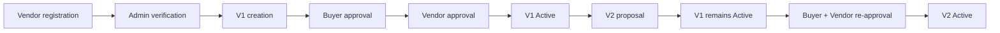

# Wedding Chain

> 블록체인 기반 웨딩 계약 버전관리 및 합의 검증 DApp

[DApp](https://wedding-chain-mvp.vercel.app) · [Kaiascan](https://kairos.kaiascan.io/address/0xF397f508D109491b5B61d24C1095EC29c9f0AfCE) · [GitHub](https://github.com/tmdwo1016/wedding-chain-mvp)

## 1. Project Overview

Wedding Chain은 웨딩 계약의 변경 이력과 당사자 합의를 검증할 수 있게 만든 DApp입니다. 웨딩 계약은 촬영 구성, 드레스 등급, 메이크업 옵션 등의 조정으로 계약 조건과 금액이 자주 바뀝니다. 이때 변경 전 계약이 무엇이었는지, 변경안에 소비자와 업체가 모두 다시 동의했는지를 확인할 수 있어야 합니다.

초기 `WeddingMarketMVP`는 상품 가격 이력과 예약 상태를 다뤘습니다. 최종 구현인 `WeddingAgreementMVP`는 단순 상품·예약 서비스가 아니라 **계약 원문의 해시, 버전별 이력, 소비자·업체의 양측 승인과 활성 버전 검증**에 초점을 둡니다. 초기 컨트랙트는 비교와 발전 과정 확인을 위해 저장소에 유지합니다.

## 2. Why Blockchain?

Wedding Chain은 일반 데이터베이스를 블록체인으로 대체하려는 프로젝트가 아닙니다. 소비자, 업체, 플랫폼처럼 이해관계가 다른 주체가 특정 플랫폼의 내부 DB만 신뢰하지 않고 동일한 계약 기록과 승인 결과를 독립적으로 확인할 수 있도록 블록체인을 공통 검증 기록으로 사용합니다.

계약서 원문과 개인정보는 Off-chain에 두고, 원문의 `keccak256` 해시와 계약 버전, 금액, 승인 여부, 상태, 당사자 지갑을 On-chain에 기록합니다. 이를 통해 공개 RPC나 블록 탐색기에서 기록을 확인하고, 보유한 계약 원문의 해시를 온체인 해시와 비교할 수 있습니다.

다만 블록체인은 잘못 입력된 정보까지 진실로 만들지는 못합니다(GIGO). 공개 체인에 개인정보를 저장할 수 없고, 모든 상태 변경에는 가스비가 들며, 지갑·네트워크 전환과 서명 과정은 일반 웹 서비스보다 복잡합니다. 계약 원문의 법적 효력, 당사자 신원, 실제 서비스 이행 역시 별도의 제도와 검증이 필요합니다.

## 3. Core Features

- MetaMask 연결 및 Kaia Kairos Testnet 전환
- 관리자, Verified Vendor, Consumer 역할 구분
- 업체 등록 요청과 관리자의 승인 또는 거절
- 관리자의 Verified 업체 자격 정지(Suspended)
- Verified Vendor만 최초 계약 V1 생성 가능
- 계약 원문을 `keccak256` 해시로 변환하여 저장
- 소비자와 업체가 최신 계약 버전을 각각 승인
- 양측 승인 전에는 V1의 `activeVersion`이 `0`으로 유지
- V2 이상 계약 변경 제안 및 모든 과거 버전 보존
- V2가 제안되어도 재승인 전까지 기존 V1이 Active로 유지
- 변경안 거절 또는 업체 철회 후에도 직전 Active 버전 유지
- 소비자와 업체의 재승인이 모두 끝나면 V2가 Active로 전환
- Agreement ID로 계약 조회
- 전 버전의 금액, 문서 해시, 승인 상태, 생성 시각 조회
- `/`와 `/agreement`에서 동일한 `AgreementDApp` 제공

## 4. Agreement Lifecycle



승인 순서는 buyer 또는 vendor 중 어느 쪽이 먼저여도 무관합니다. 핵심 조건은 최신 버전에 대한 양측 승인이 모두 완료되어야만 해당 버전이 활성화된다는 점입니다.

## 5. 실제 테스트 사례 — Agreement #2

| 단계 | 금액 | 승인 상태 | 활성 버전 |
| --- | ---: | --- | --- |
| V1 생성 | 3,800,000 KRW | 승인 전 | 없음 (`0`) |
| Buyer 승인 | 3,800,000 KRW | Buyer Approved | 없음 (`0`) |
| Vendor 승인 | 3,800,000 KRW | 양측 승인 완료 | V1 Active |
| V2 제안 | 4,100,000 KRW | V2 승인 전 | V1 Active 유지 |
| V2 양측 재승인 | 4,100,000 KRW | 양측 승인 완료 | V2 Active |

V2가 활성화된 뒤에도 V1의 금액, 문서 해시, 승인 상태와 생성 시각은 과거 버전으로 계속 조회할 수 있습니다.

## 6. Smart Contract Design

구현 파일: [`contracts/WeddingAgreementMVP.sol`](contracts/WeddingAgreementMVP.sol)

### 주요 enum / struct

| 타입 | 역할 |
| --- | --- |
| `VendorStatus` | `None`, `Pending`, `Verified`, `Rejected`, `Suspended`로 업체 심사 상태 표현 |
| `AgreementStatus` | `None`, `PendingApproval`, `Active`, `ChangePending`, `Cancelled`로 계약 상태 표현 |
| `AgreementVersionStatus` | `None`, `Pending`, `Active`, `Rejected`, `Cancelled`로 버전 처리 상태 표현 |
| `VendorApplication` | 업체 지갑, 카테고리, 메타데이터 URI, 심사 상태와 시각 저장 |
| `Agreement` | 계약 ID, buyer/vendor, 활성·최신 버전, 상태와 생성 시각 저장 |
| `AgreementVersion` | 버전, 문서 해시, 원화 금액, 양측 승인 여부와 생성 시각 저장 |

### 주요 함수

| 함수 | 역할 |
| --- | --- |
| `requestVendorRegistration` | 업체가 카테고리와 메타데이터 URI로 등록 요청 |
| `approveVendor` | owner가 Pending 업체를 Verified로 승인 |
| `rejectVendor` | owner가 Pending 업체를 Rejected로 변경 |
| `revokeVendor` | owner가 Verified 업체를 Suspended로 변경 |
| `createAgreement` | Verified Vendor가 buyer, V1 문서 해시, 금액으로 계약 생성 |
| `proposeAgreementVersion` | 계약 업체가 Active 계약에 새 버전을 제안 |
| `approveAgreementVersion` | buyer 또는 vendor가 최신 버전을 승인하고, 양측 승인 시 활성화 |
| `rejectAgreementVersion` | 계약 당사자가 최신 대기 버전을 거절하고 기존 Active 버전을 유지 |
| `cancelPendingAgreementVersion` | vendor가 최신 대기 버전을 철회하고 기존 Active 버전을 유지 |
| `getAgreement` | 계약 당사자, 상태, 활성·최신 버전 조회 |
| `getAgreementVersion` | 특정 계약의 특정 버전 상세 조회 |
| `getBuyerAgreementIds` | buyer 지갑에 연결된 계약 ID 목록 조회 |
| `getVendorAgreementIds` | vendor 지갑에 연결된 계약 ID 목록 조회 |

컨트랙트는 새 버전을 기존 저장소 위에 덮어쓰지 않습니다. `activeVersion`과 `latestVersion`을 분리하여 변경안이 대기 중일 때도 직전 합의 버전을 식별할 수 있습니다.

## 7. On-chain / Off-chain Design

| On-chain | Off-chain |
| --- | --- |
| Agreement ID | 계약서 원문 |
| Buyer / Vendor wallet | 이름 / 전화번호 |
| Version | 상담 내역 |
| Document hash | 상세 옵션 |
| `amountKRW` | 사진 |
| Buyer / Vendor approval | 기타 개인정보 |
| Agreement status |  |
| 생성·심사 시각과 승인·활성화 이벤트 시각 |  |

`amountKRW`는 계약 금액을 표시하기 위한 원화 정수이며 토큰 결제 금액이 아닙니다. 계약 승인 기록은 최신 버전에 대해서만 추가할 수 있고, 승인·활성화 시각은 이벤트로도 추적할 수 있습니다.

## 8. Tech Stack

| 구분 | 기술 |
| --- | --- |
| Smart Contract | Solidity `^0.8.24` |
| Network | Kaia Kairos Testnet |
| Contract tooling | Remix / Kaia Plugin |
| Frontend | Next.js 16, React 19 |
| Language | TypeScript |
| Web3 library | ethers.js 6.17 |
| Wallet | MetaMask |
| Deployment | Vercel |

## 9. Deployment

| 항목 | 값 |
| --- | --- |
| Smart Contract | `WeddingAgreementMVP` |
| Deployment Address | [`0xF397f508D109491b5B61d24C1095EC29c9f0AfCE`](https://kairos.kaiascan.io/address/0xF397f508D109491b5B61d24C1095EC29c9f0AfCE) |
| Network | Kaia Kairos Testnet |
| Chain ID | `1001` (`0x3e9`) |
| RPC | `https://public-en-kairos.node.kaia.io` |
| Explorer | [https://kairos.kaiascan.io](https://kairos.kaiascan.io) |
| DApp | [https://wedding-chain-mvp.vercel.app](https://wedding-chain-mvp.vercel.app) |
| GitHub | [https://github.com/tmdwo1016/wedding-chain-mvp](https://github.com/tmdwo1016/wedding-chain-mvp) |

## 10. Local Run

Node.js와 npm, MetaMask를 준비한 뒤 다음 명령을 실행합니다.

```bash
git clone https://github.com/tmdwo1016/wedding-chain-mvp.git
cd wedding-chain-mvp/frontend
npm install
npm run dev
```

기본 개발 주소인 [http://localhost:3000](http://localhost:3000)을 열고 MetaMask에서 Kaia Kairos Testnet에 연결합니다. 상태를 변경하는 계정에는 테스트 KAIA가 필요합니다.

## 11. Current Scope / Future Work

### Current

- 업체 등록과 관리자 검증
- 계약 생성과 document hash 기록
- 소비자·업체 양측 승인
- 계약 버전관리와 버전별 이력 조회
- Kaia Kairos Testnet 배포
- Web DApp 연동

### Not implemented

- 실제 원화 / KAIA 결제
- Escrow와 자동 환불
- 분쟁 중재
- 개인정보 DB
- 실제 계약서 파일 업로드 / 다운로드

### Future

- Off-chain DB와 계약 원문 파일 저장
- 보유 파일과 온체인 document hash를 비교하는 검증 UI
- Escrow / refund
- Dispute resolution
- Notification / dashboard

## 12. Repository Structure

```text
wedding-chain-mvp/
├── contracts/
│   ├── WeddingAgreementMVP.sol  # 최종 계약 버전관리·합의 컨트랙트
│   ├── archive/WeddingAgreementMVP_v1.sol # 이전 Agreement 컨트랙트 보존본
│   └── WeddingMarketMVP.sol     # Phase 1 비교·백업용 컨트랙트
├── frontend/
│   ├── app/
│   │   ├── agreement/page.tsx   # /agreement 라우트
│   │   └── page.tsx             # / 라우트
│   ├── components/
│   │   └── AgreementDApp.tsx    # 최종 DApp UI와 컨트랙트 연동
│   ├── package.json
│   └── README.md
├── CHANGELOG.md
└── README.md
```

생성 파일인 `node_modules`, `.next`, `cache`, `artifacts`와 환경 변수 파일은 `.gitignore`에서 제외합니다.

## 13. Project History / Update Summary

- **Phase 1 — WeddingMarketMVP:** 상품 가격 이력과 예약 상태 검증 MVP
- **Phase 2 — WeddingAgreementMVP:** 계약 원문 hash, 버전, 소비자·업체 양측 승인 구조로 확장
- **Final:** V1/V2 lifecycle과 변경 버전 재승인 Web DApp 구현, Vercel main URL을 최종 Agreement DApp으로 변경
- **v2:** 업체 자격 정지, 변경안 거절·철회, 버전 상태와 기존 Active 계약 보존 로직 반영

자세한 변경 내역은 [`CHANGELOG.md`](CHANGELOG.md)를 참고하세요.
