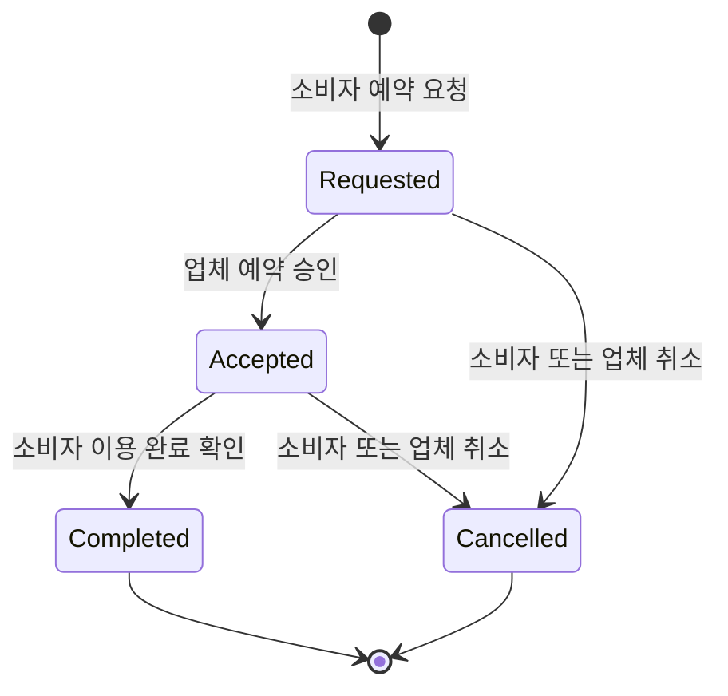
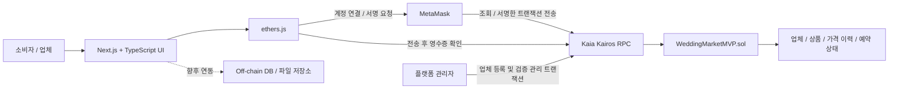

# Wedding Chain

### Kaia 기반 스드메 가격 투명화 및 예약 DApp

**Wedding Chain**은 웨딩 스드메(스튜디오·드레스·메이크업) 상품의 가격 변경 이력과 예약 과정을 블록체인에 기록하는 **블록체인 수업 기말 프로젝트**입니다.

소비자는 공개된 상품 가격을 조회하고 예약을 요청하며, 업체는 예약을 승인하고 소비자는 이용 완료를 확인합니다. 이 과정을 Kaia Kairos Testnet에 기록하여, 플랫폼 화면뿐 아니라 트랜잭션과 스마트컨트랙트 상태를 통해서도 확인할 수 있도록 구현했습니다.

> 가격 정보의 투명성과 예약 기록의 검증 가능성을 탐구하는 테스트넷 MVP입니다. 상품 대금 결제는 포함하지 않습니다.

## 1. 프로젝트 배경

웨딩 상품은 기본 패키지에 촬영 옵션, 드레스 등급, 메이크업 구성 등의 조건이 더해지면서 최종 견적이 달라질 수 있습니다. 기존 웨딩 플랫폼에서 가격이 상담 이후 공개되거나 옵션별 비용과 변경 이력이 충분히 제공되지 않으면, 소비자는 같은 조건의 상품을 비교하고 이전 견적을 확인하기 어렵습니다.

이 프로젝트는 이러한 **가격 불투명성과 소비자·업체 간 정보 비대칭**에 주목했습니다.

- **가격 공개:** 등록된 상품의 현재 가격을 누구나 조회할 수 있도록 합니다.
- **변경 이력 추적:** 가격이 바뀌면 이전 가격, 변경 가격과 시점을 기록합니다.
- **예약 과정 검증:** 예약 당시 가격과 요청·승인·이용 완료 상태를 기록합니다.

## 2. Why Blockchain

**일반적인 데이터베이스로도 상품 관리와 예약 기능은 구현할 수 있습니다.** Wedding Chain에서 블록체인을 사용하는 목적은 예약 기능 자체보다, 여러 참여자가 **가격 변경 이력과 예약 기록을 검증할 수 있는 공통 기록**을 만드는 데 있습니다.

| 적용 지점 | 블록체인을 사용하는 이유 |
| --- | --- |
| 가격 변경 이력 | 컨트랙트를 통한 가격 변경을 이력과 이벤트로 남겨 이전 가격과 변경 시점을 추적 |
| 예약 당시 가격 | 예약 생성 시점의 상품 가격을 `bookedPriceKRW`로 저장해 이후 상품 가격과 구분 |
| 예약 상태 변경 | 소비자의 요청, 업체의 승인, 소비자의 이용 완료 확인을 각 지갑의 트랜잭션으로 기록 |
| 외부 검증 | 플랫폼 DB에 대한 접근 권한 없이도 공개 RPC와 블록 탐색기로 기록 확인 |

### 블록체인이 보장하지 않는 것

블록체인은 **입력 정보 자체의 진실성을 보장하지 않습니다.** 업체가 등록한 가격이 실제 상담 가격과 같은지, 상품 설명이 정확한지, 서비스가 실제로 제공되었는지는 온체인 기록만으로 확정할 수 없습니다. 소비자의 이용 완료 트랜잭션도 해당 지갑이 완료를 확인했다는 기록입니다.

따라서 **업체 인증은 플랫폼 관리자가 담당**합니다. 관리자가 업체 지갑을 등록하고 검증 상태를 관리하며, 검증된 업체가 상품과 가격을 등록·변경할 수 있도록 설계했습니다. 관리자에 대한 신뢰는 여전히 필요하며, 블록체인은 등록 이후의 기록과 권한에 따른 상태 변경을 검증하는 역할을 합니다.

## 3. 핵심 사용자 흐름

| 사용자 | 주요 동작 |
| --- | --- |
| 플랫폼 관리자 | 업체 지갑 등록 및 검증 상태 관리 |
| 업체 | 상품 등록·가격 변경, 들어온 예약 승인 |
| 소비자 | 상품 가격 조회, 예약 요청, 이용 완료 확인 |



현재 웹 화면에서는 **상품 조회 → 예약 생성 → 업체 승인 → 소비자 이용 완료**를 실행할 수 있습니다. 업체 등록, 가격 관리와 예약 취소는 스마트컨트랙트에 구현되어 있으며 별도의 관리 UI는 아직 제공하지 않습니다.

## 4. 기술 스택

| 구분 | 기술 | 역할 |
| --- | --- | --- |
| 블록체인 네트워크 | Kaia Kairos Testnet | 스마트컨트랙트 배포 및 트랜잭션 실행 |
| 스마트컨트랙트 | Solidity `^0.8.24` | 업체·상품·가격 이력·예약 상태 관리 |
| 프론트엔드 | Next.js 16, React 19 | 역할별 DApp 화면 구성 |
| 언어 | TypeScript | 프론트엔드 상태와 블록체인 연동 코드 작성 |
| 스타일 | Tailwind CSS 4 | 상품·예약 카드 및 상태 표시 |
| 블록체인 라이브러리 | ethers.js 6.17.0 | 컨트랙트 조회, 지갑 signer 연동, 영수증·이벤트 해석 |
| 지갑 | MetaMask | 계정 연결 및 트랜잭션 서명·승인 |

## 5. System Architecture



- **조회:** 프론트엔드가 ethers.js와 MetaMask provider를 통해 상품·예약 상태를 읽습니다.
- **상태 변경:** 사용자가 MetaMask에서 승인한 트랜잭션을 컨트랙트가 권한과 현재 상태에 따라 처리합니다.
- **결과 확인:** 프론트엔드는 Kairos RPC에서 영수증과 이벤트를 확인하고 최신 예약 상태를 다시 조회합니다.
- **외부 데이터:** 상세 콘텐츠와 개인정보용 Off-chain 저장소는 향후 연동할 설계 영역이며, 현재 MVP에 별도 백엔드나 DB는 구현하지 않았습니다.

## 6. Smart Contract 주요 기능

구현 파일: [`contracts/WeddingMarketMVP.sol`](contracts/WeddingMarketMVP.sol)

| 기능 | 주요 함수 | 동작 |
| --- | --- | --- |
| 업체 인증 관리 | `registerVendor`, `setVendorVerified` | 플랫폼 관리자가 업체 지갑 등록 및 검증 상태 변경 |
| 상품 등록 | `addProduct` | 검증된 업체가 상품명·메타데이터 URI·원화 가격 등록 |
| 가격 투명화 | `updateProductPrice`, `getPriceHistory` | 상품 가격 변경 및 이전·새 가격과 변경 시각 조회 |
| 상품 조회·판매 상태 | `getProduct`, `setProductActive` | 상품 정보 조회 및 판매 활성화 여부 변경 |
| 예약 요청 | `createBooking` | 상품 가격을 예약에 저장하고 `Requested` 상태 생성 |
| 업체 승인 | `acceptBooking` | 해당 예약의 업체가 `Requested → Accepted`로 변경 |
| 이용 완료 | `completeBooking` | 해당 예약의 buyer가 `Accepted → Completed`로 변경 |
| 예약 취소 | `cancelBooking` | 소비자 또는 업체가 요청·승인 상태의 예약 취소 |
| 예약 조회 | `getBooking`, `getBuyerBookingIds`, `getVendorBookingIds` | 예약 상세 및 지갑별 예약 ID 조회 |

`ProductPriceUpdated`, `BookingCreated`, `BookingStatusChanged` 등의 이벤트로 변경 내용을 추적합니다. 승인과 완료 처리는 예약 당사자 및 상태 전이 조건을 컨트랙트에서 검사합니다.

## 7. On-chain / Off-chain 데이터 구분

| 구분 | 데이터 | 구현·설계 상태 |
| --- | --- | --- |
| On-chain | 업체 지갑·카테고리·검증 상태 | 구현 완료 |
| On-chain | 상품 ID·업체 주소·상품명·`priceKRW`·판매 상태·생성 시각 | 구현 완료 |
| On-chain | 이전 가격·새 가격·가격 변경 시각 | 구현 완료 |
| On-chain | 예약 ID·buyer·vendor·상품 ID·예약 당시 가격·상태·생성 시각 | 구현 완료 |
| On-chain | 업체·상품의 `metadataURI`, 상태 변경 이벤트 | 구현 완료 |
| Off-chain | 업체 상세 소개, 상품 사진, 옵션 설명 | 외부 저장소 연동 예정 |
| Off-chain | 이름·연락처·상담 내용 등 개인정보 | Off-chain 저장 및 접근 제어로 설계, 현재 수집·저장 기능 미구현 |

현재 컨트랙트에는 **외부 데이터의 위치를 나타내는 `metadataURI`**를 저장합니다. 파일 자체나 개인정보를 저장하지 않으며, URI가 가리키는 콘텐츠의 무결성을 검증하는 해시 기능은 아직 구현하지 않았습니다. 지갑 주소와 온체인 데이터는 공개되므로 개인정보를 `metadataURI`나 상품명에 직접 넣지 않는 설계가 필요합니다.

## 8. 실제 테스트 결과

Kaia Kairos Testnet에서 Product #1에 대한 예약 생성, 업체 승인, 소비자 이용 완료 흐름을 테스트했습니다.

| 항목 | 테스트 결과 |
| --- | --- |
| 상품 | **Product #1 · Studio Basic** |
| 상품 가격 | **900,000원** |
| 예약 | **Booking #2** |
| 상태 변화 | **Requested (0) → Accepted (1) → Completed (2)** |

### 트랜잭션 기록

| 단계 | 실행 함수 | 처리 후 상태 |
| --- | --- | --- |
| 소비자 예약 생성 | `createBooking(1)` | Booking #2 · Requested (0) |
| 업체 예약 승인 | `acceptBooking(2)` | Accepted (1) |
| 소비자 이용 완료 | `completeBooking(2)` | Completed (2) |

- **예약 생성 TX:** [0x9ff7a0abac6fb68fa6549c370ae145500820c499307de29ee488573dd131e8ae](https://kairos.kaiascan.io/tx/0x9ff7a0abac6fb68fa6549c370ae145500820c499307de29ee488573dd131e8ae)
- **업체 승인 TX:** [0xecdc58175b7657b09116cf75a0291a68fe28cf06481d06bfbe1c6503bb1b4280](https://kairos.kaiascan.io/tx/0xecdc58175b7657b09116cf75a0291a68fe28cf06481d06bfbe1c6503bb1b4280)
- **이용 완료 TX:** [0xdae12138ac4196fe111acf467a102ecda3a05b8578df94f31304f4bd3c5d50a3](https://kairos.kaiascan.io/tx/0xdae12138ac4196fe111acf467a102ecda3a05b8578df94f31304f4bd3c5d50a3)

각 링크에서 트랜잭션 영수증과 이벤트를 확인할 수 있습니다. 위 가격과 상태는 테스트 기록이며, 화면은 컨트랙트의 조회 응답을 표시합니다. `priceKRW`는 원화 표시용 정수로, 토큰 전송 금액이 아닙니다.

## 9. 배포 정보

| 항목 | 값 |
| --- | --- |
| 네트워크 | Kaia Kairos Testnet |
| Chain ID | `1001` (`0x3e9`) |
| RPC | `https://public-en-kairos.node.kaia.io` |
| 통화 기호 | `KAIA` |
| Contract Address | `0xFE8ADdfb365bc0CD0e4f054F679e1720b4b23f20` |

[배포된 컨트랙트 보기](https://kairos.kaiascan.io/account/0xFE8ADdfb365bc0CD0e4f054F679e1720b4b23f20)

## 10. 실행 방법

Node.js와 npm, MetaMask 확장 프로그램을 준비합니다. 트랜잭션 실행 계정에는 가스비를 낼 테스트 KAIA가 필요합니다.

```bash
git clone https://github.com/tmdwo1016/wedding-chain-mvp.git
cd wedding-chain-mvp/frontend
npm ci
npm run dev
```

브라우저에서 [http://localhost:3000](http://localhost:3000)을 열고 MetaMask를 Kaia Kairos Testnet에 연결합니다. 이후 계정 역할에 따라 상품 조회·예약 요청, 업체 승인, 소비자 이용 완료를 진행할 수 있습니다.

이미 저장소를 내려받았다면 프로젝트 루트에서 `cd frontend` 이후 명령을 실행하세요. 상세한 구현 및 테스트 방법은 [프론트엔드 기술 문서](frontend/README.md)에 정리되어 있습니다.

## 11. 현재 한계

- **결제 / Escrow 미구현:** 상품 대금을 보관·정산하거나 환불하는 기능은 없습니다.
- **테스트넷 MVP:** 수업 프로젝트를 위한 구현이며 운영 환경의 보안 감사와 실사용 검증은 수행하지 않았습니다.
- **개인정보는 Off-chain으로 설계:** 개인정보 저장소와 접근 권한 관리를 포함한 백엔드는 아직 구현하지 않았습니다.
- **데모 대상 고정:** 웹 UI의 상품 조회·예약 생성은 Product #1, 업체 승인·이용 완료는 Booking #2를 대상으로 합니다. 새 예약을 생성해도 관리 대상 ID가 자동으로 바뀌지 않습니다.
- **일부 관리 UI 미구현:** 업체 등록, 가격 변경·이력 조회, 예약 취소는 컨트랙트 기능을 중심으로 구현했습니다.
- **실제 서비스 정보의 검증 한계:** 업체 인증과 입력 내용의 정확성에는 관리자와 외부 검증 절차가 필요합니다.
- **가격 확정 시점:** 예약 가격은 컨트랙트 실행 시점의 상품 가격입니다. 사용자 확인 후 트랜잭션 처리 전 가격이 변경되면 화면에서 본 가격과 달라질 수 있습니다.

## 12. 향후 확장 기능

- 여러 업체·상품 탐색, 필터링과 상품별 상세 페이지
- 연결 지갑의 전체 예약 목록 및 예약 ID에 따른 관리 화면
- 가격 변경 이력 시각화와 옵션별 가격 비교
- 업체 인증·상품 관리용 관리자 및 업체 대시보드
- 결제·Escrow·정산·환불과 분쟁 처리 정책
- 개인정보를 분리한 Off-chain DB와 파일 저장소, 접근 권한 관리
- 외부 메타데이터의 해시 기록 및 무결성 검증
- 컨트랙트 자동 테스트, 보안 검토와 메인넷 배포 준비

## 프로젝트 구성

```text
wedding-chain-mvp/
├── README.md                       # 프로젝트 소개 및 포트폴리오
├── contracts/
│   └── WeddingMarketMVP.sol         # 업체·상품·가격·예약 컨트랙트
└── frontend/
    ├── README.md                   # 구현 상세 및 테스트 기술 문서
    ├── app/
    │   └── page.tsx                # 지갑 연결과 예약 DApp 화면
    └── package.json
```
